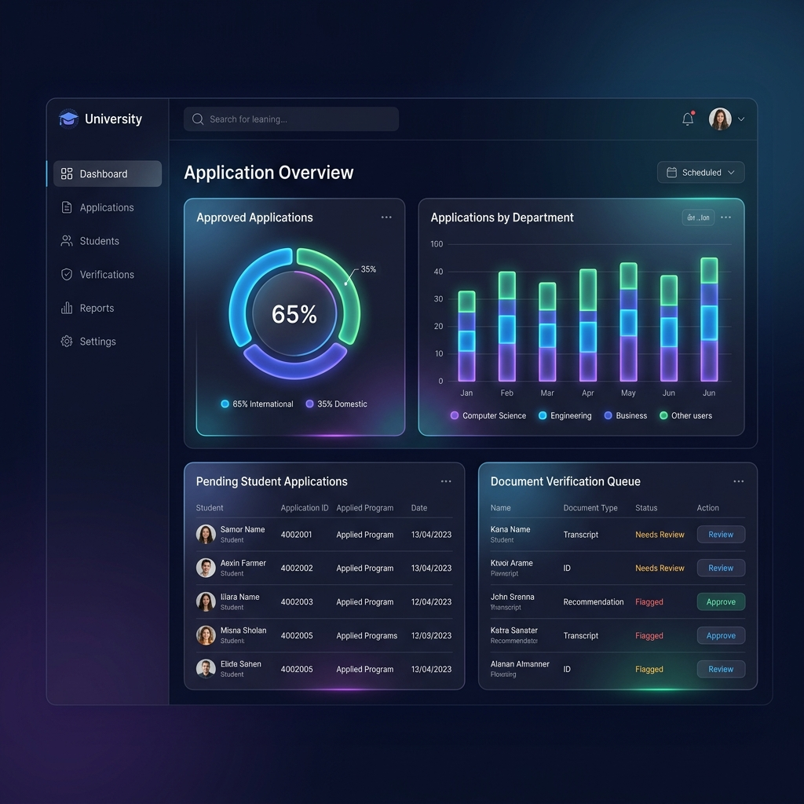

# 🎓 Online Admission System


A modern, responsive, and robust **PHP & MySQL** web application designed to digitize and streamline the university admission process. The platform automates student registration, document verification, status tracking, and notification workflows, reducing administrative workload and manual errors.

---

## 🛠️ Tech Stack & Architecture


---

## 🚀 Key Features

### 👨‍🎓 For Students
- **Online Application Form**: Seamlessly fill out personal, contact, and academic details.
- **Document Manager**: Upload required documents (photographs, certificates, mark sheets, and ID proof) directly to the portal.
- **Admit Card Downloader**: Access and download automatically generated admit cards once approved.
- **Result Portal**: Conveniently check CUEE marks and overall admission results.

### 💼 For Administrators & Managers
- **Application Review Panel**: Easily view, approve, or reject student applications.
- **Verification Dashboard**: Visually inspect uploaded student documents.
- **Academic Score Entry**: Submit CUEE scores directly into the database.
- **Automated Mail Alerts**: Instantly send status updates and verification results to students' emails.

---

## 📋 Admission Workflow


1. **Sign Up & Register**: Student creates an account on the platform.
2. **Form Submission**: Student submits the application form and uploads required academic certificates.
3. **Manager Review**: The university manager evaluates the documents.
4. **Outcome Notification**:
   - **Approved**: An email is dispatched with instructions to download the Admit Card.
   - **Disapproved**: Notification email sent to re-verify details.

---

## 🖥️ Portal Dashboard



---

## 🎯 Project Objectives

- **Time Efficiency**: Dramatically reduce application processing time and eliminate queues.
- **Reliability & Accuracy**: Store secure personal and academic records in structured database schemas.
- **Paperless Workflow**: Transition to full digital tracking, saving physical resources and files.
- **User-Centric Design**: Simple, intuitive interfaces optimized for students and administrative staff.

---

## ⚙️ Installation & Setup

### Prerequisites
- PHP `>= 5.5`
- MySQL / MariaDB
- Web Server (Apache/XAMPP/WAMP)

### Setup Steps
1. **Clone the Repository**:
   ```bash
   git clone https://github.com/vijaymahes9080/Online-Admission-System-php.git
   cd Online-Admission-System-php
   ```
2. **Import Database**:
   - Start MySQL server and open phpMyAdmin.
   - Create a database named `oas`.
   - Import the database dump file [oas.sql](oas.sql) to set up tables and default entries.
3. **Configure Database Settings**:
   - Configure credentials in [dbcontroller.php](dbcontroller.php) if you use a custom root password.
4. **Configure Mail Settings**:
   - Open [mail/email.php](mail/email.php) and configure your Gmail SMTP username and App Password:
     ```php
     $mail->Username = "your_email@gmail.com";
     $mail->Password = "your_gmail_app_password";
     ```
5. **Run Locally**:
   - Copy the project to your Apache root directory (e.g., `htdocs` in XAMPP).
   - Navigate to `http://localhost/Online-Admission-System-php` in your browser.

---

## 🤝 Developer & License

- **Developer**: Vijay Mahes ([vijaymahes9080](https://github.com/vijaymahes9080))
- **License**: MIT License - see the [LICENSE](LICENSE) file for details.
